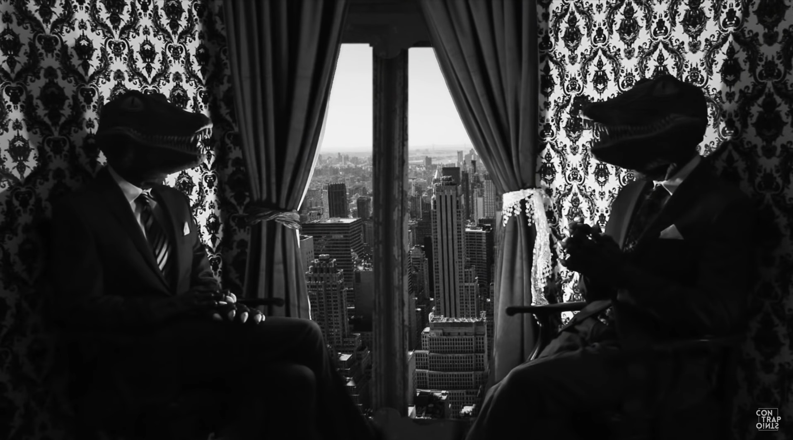
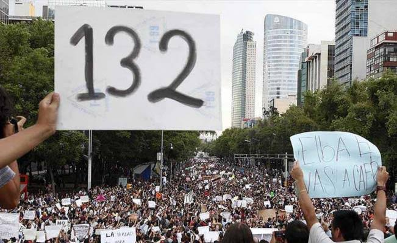
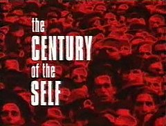
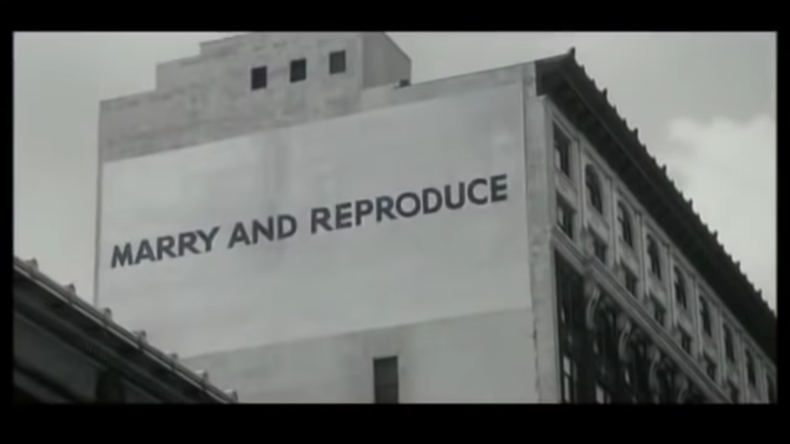

# ¡ESTOS SON LOS PROBLEMAS REALES!

## El estado actual de las cosas

Aunque usted no lo crea, no vivimos por sino a pesar del capitalismo. Se calcula que el ritmo de producción de la economía global necesita de aproximadamente cuatro planetas Tierra para ser sostenible. La producción de imágenes para capturar el deseo de todas las personas y orientarlos a la acumulación de mercancías a través de la industria cultural nos hace desear el dinero para cumplir con un montón de estereotipos sociales impuestos por la publicidad. ¿Cómo? A través del miedo y la promesa de algún día estar por encima de las demás personas. Mientras, el trabajo se vuelve más precario conforme la optimización y automatización, administrativa y de procesos, se desarrolla en la economía global. A los desempleos masivos hay que sumar la incapacidad de los Estados de solventar las deudas sociales, de garantizar algún mínimo de estabilidad o de responder por la gente viviendo en la miseria. Nadie se da cuenta de que se enferma por el cambio climático porque no hay responsables aparentes para la contaminación y deterioro acelerado del planeta y de los recursos disponibles. El _mainstream_ tiende a asociar a la enfermedad con el azar o a la voluntad de Dios, una creencia azarosa que solo hace que las personas sigan aguantando las injusticias, para que sigan trabajando y comprando cosas que las hagan sentir valiosas.

A nuestros padres y a algunas personas historiadoras les encanta señalar que el mundo tiene un cauce definido. Sin embargo, saber cómo han sido las cosas en el pasado no significa que estemos condenadas a vivir lo mismo. Reconocer nuestro pasado es el mejor punto de partida para dar forma a un porvenir. Nuestra generación vive cada vez más la tecnología como una cuestión política. La potencia de la piratería y de los movimientos de código abierto (*open source*) son ejemplos de cooperación más allá del mero lucro. Este es un punto de partida que nos da la fuerza para crear un movimiento que nos ayude a ocupar y abrir diferentes espacios. Las personas *millennial* hemos nacido en una tensión histórica. Por un lado, tenemos acceso a un montón de información y un anhelo de libertad que nos impulsa a salir a la calle para encontrar una alternativa al presente. Por el otro, somos presas de la economía de la atención, personas adictas a interacciones virtuales y a códigos publicitarios cada vez más seductores.

Aunado a ello, las formas de violencia a las que son sometidas las personas son múltiples y complejas. Una apuesta política transformadora tiene que permitir reconocer estas violencias y dar herramientas para poder combatir. Queremos que todas podamos luchar.

Hay una diferencia abismal entre la violencia total, mutilante, hacia un enemigo abstracto (los criminales, las drogas, "el enemigo") y el roce propio del conflicto en la palabra, a través del habla y la escucha, mucho más vital y espontáneo, donde somos cuerpos que resuenan, que se transmiten. El problema es que nos enseñan que la violencia física, el poder del Estado, es la única manera de lidiar con nuestras diferencias, con nuestros deseos y con el desacuerdo. Para una transformación real, tenemos que hacer ingeniería inversa la caja negra y tratar de entender cómo se configuran las relaciones de poder y las reglas que dan sentido al Estado. Vivimos en una era en la que, con internet, robots y un sinfín de tecnologías, es técnicamente posible hacerlo. Se trata de permitir que todas las personas seamos co-creadoras de la realidad, que seamos potentes.

## Wikipolítica, ¿partido?

En 2018, Wikipolítica apostó todo por ocupar el Poder Legislativo en diversos estados de la República mexicana. Si bien no negamos que este es un paso necesario para proyectos de cabildeo estratégico, al no tener una visión de largo plazo, es decir, un programa de gobierno, nuestro experimento creó una red de voluntarias para salir calle a costa de reproducir las mismas dinámicas de explotación que cualquier trabajo o forma de activismo tradicional. Nos encontramos frente a un problema muy grave porque la energía de todas las personas decayó con nuestra terrible derrota en la contienda.

Frente a ello, la respuesta de algunas personas ha sido iniciar otro aparatoso e incierto proceso para crear un partido electoral. Desafortunadamente, el contexto del país es apremiante y la burocracia electoral es un camino de picar piedra. Vivimos una guerra que ha dejado cientos de miles de personas muertas y desaparecidas. Esto nos obliga a pensar en una alternativa radical al modelo extractivista, dependiente de los capitales financieros internacionales. Para muchas de nosotras esta guerra es invisible, pues, en efecto, es difícil reconocer que vivimos en una guerra por la fortuna de vivir en zonas seguras que están lejos de las huellas de la pobreza y la miseria, ya sea en otro país, en otra ciudad o simplemente en otro barrio. Nuestra incapacidad de verlo no significa que la crisis sistemática de derechos humanos, el exterminio feminicida, el auge del totalitarismo tradicionalista y el creciente poder de los capitales extranjeros no exista o vaya a terminar por sí solo.

La situación de nuestro país nos coloca frente a un problema de asimetrías de poder muy claro. Aunado a eso, desde 2016 este país se encuentra en un Estado de excepción. El despliegue y la militarización de las fuerzas del orden tienen como propósito hacerse del control territorial que el narco ha arrebatado al Estado mexicano, pero también para identificar, vigilar y repeler con hostilidad mortal a quien se oponga a los reptiles que pagan a las corporaciones armadas para velar por sus intereses.

Ya, en serio, los reptilianos quizá no sean lagartos pero sí agentes de la utilidad, del plusvalor, es el 1% que siempre están buscando especular con su dinero para generar más dinero, a costa de quien sea y de cualquier daño al ambiente.

Volviendo al tema, la idea de un Partido meramente electoral es poco eficiente y bastante proclive al corporativismo patriarcal. Muchos machos adeptos a la disciplina del Partido hegemónico son también virilistas, amantes de la disciplina y el sometimiento al falo (al sacerdote, al patriarca), de la camaradería buenaondita que invisibiliza las incapacidades de quienes asumen el papel de soldado razo en un ejército de activistas. Como si de la disciplina y el control fuese posible producir otra cosa que no sea represión y esquizofrenia.

La historia no tiene un motor y cada cambio lleva consigo una posición sobre el presente, sobre el ahora. Lo único que nos permite creer en nuestra posición como *La Partida* es la tecnocrítica, que significa que a cada instante nos cuestionamos cómo hacer cosas efectivas. Recuerden que la pregunta que nos hace pensar en el porvenir es cómo nos organizamos estratégicamente sobre los problemas estructurales que originan más formas de violencia. Si no pensamos así, seguimos en una cultura de la inmediatez que niega la magnitud y complejidad del problema, que sigue la corriente de los medios de señalar que no hay alternativas sistemáticas que nos muestren imágenes de otra sociedad.

Nos encanta la posición feminista que no encuentra sentido en la necedad electoral y en el deseo de Estado que late en la representación política. Nos parece que más allá de conquistar la hegemonía sobre UN sentido común, se trata de crear canales por donde naveguen ríos de una multiplicidad de sentidos. Para nosotras, se trata de ir más allá de la vieja dicotomía izquierda y derecha. No queremos representar a nadie, ni gobernar, pero sí que nos preocupa la representación y el gobierno. Queremos que la gente recupere su propia voz, que ella misma pueda defender sus batallas, no queremos más paternalismos. Compartimos la lucha de la gente que pugna por una libertad radical, queremos dar voz, pero no partimos del dolor, partimos de la alegría y de la tecnocrítica como fe práctica, como creencia en la acción. Queremos que la gente pueda gobernarse maximizando la eficiencia de sus recursos y brindándoles nuevas herramientas. Sentimos que se trata de resetear los símbolos culturales que existen alrededor de las herramientas que nos permiten gestionarnos. A lo largo de estos años, nos hemos dado cuenta de que es muy probable que las cosas que se te ocurran para hacer un cambio suenen demasiado obvias, o sean muy difíciles o ya existan. En ese sentido, creemos que la tarea está en descubrir cómo hacerlas fáciles o que, si existen, sean conocidas por la gente que quieres que lo conozca, es decir, en crear una práctica de *mainstreaming politics* (políticas sobre canales masivos).[^2]

## ¿Qué tan efectivo es el activismo?

Los análisis de muchos activistas intelectuales de izquierda presuponen conspiraciones globales elaboradas, como si la estupidez global contemporánea fuera algo planeado. Ni siquiera los reptilianos en sus reuniones en Davos piensan en controlar al mundo. La modernidad es un discurso al cual aferrarse cuando en verdad el Medioevo nunca acabó. La aristocracia, la burguesía, la gente en el poder, son solo idiotas a quienes les gusta tener pisos de mármol, comer en restaurantes caros, vestir ropas caras y mirar sus números crecer.

>La verdadera tragedia del presente es lo que alguien llamaba la *banalidad del mal*.

Mientras, nosotras vemos que el problema más grave que enfrentan las resistencias de calle es *articularse* con otros esfuerzos. Muchas redes de movimientos de base, de activistas defensores de DD.HH., etc, tienen que trabajar con la sociedad civil, otra casta de aristoburguesía que actúa desde una clase privilegiada. Aunque no lo parezca, incluso en las resistencias pervive la lucha de clases.

A veces parece que entre las personas activas políticamente prevalece una atmósfera de rectitud moral, como si fuera evidente que lo que están haciendo para tratar de cambiar el estado de las cosas es lo correcto. En términos prácticos, resulta poco atinado querer imponernos frente a la gente, tomar nuestra visión política como algo evidente, con un vocabulario cerrado, cuando es una cosmovisión de clase (es decir, condicionada por nuestros hábitos de consumo y poder adquisitivo). La lucha es más eficiente entre más aprendemos a compartir, a socializar, a hacer un ejercicio mayéutico que le permita a la banda darse cuenta por ella misma de lo que quieres hacerle ver.

En este sentido, la militancia requiere aprender a escuchar a las personas para tener una aproximación más o menos clara de sus creencias para entender que la persuasión está en la apertura misma al diálogo. Después de todo, la libertad sólo existe en el momento en que somos capaces de tomar una decisión, y la lucha política es una decisión, nunca es evidente. Para empatizar, una tiene que posicionarse con ternura radical frente al otro. Hay que tener presente que las cosas que otras personas hacen tienen sentido de algún modo, al menos para ellas. En pocas palabras, no hay ninguna forma de vida que sea intrínsecamente más valiosa que otra. La clave está en reconocer los afectos como parte de la racionalidad política.

Mientras tanto, las personas afines al liberalismo (a la buenaonda, a la omisión del conflicto, a quienes reconocen que la única posibilidad es institucional) se retuercen frente a un momento de posverdad y de noticias falsas. No se explican qué llevó al mundo a semejante "irracionalidad", no entienden que jamás la hubo y que los síntomas contemporáneos son también una oportunidad de crear un nuevo horizonte político. En medio de la crisis que vivimos diariamente, nuestra experiencia de la realidad como flujos de información (*links, chats, shares*...) nos da una capacidad que antes era imposible, para producir efectos en el mundo. Pero nuestra generación sufre porque somos conscientes del cinismo ilustrado que prevalece en el espíritu universitario, porque sabemos que tenemos el potencial técnico para vivir un mundo abierto, libre, pero no sabemos cómo (¿o realmente no queremos?) crearlo.

Nuestra visión de la estrategia simpatiza con una corriente conocida como xenofeminismo interseccional y considera que las subjetividades están atravesadas por el género y por otras categorías que causan opresión en distintas dimensiones. La novedad radica en concebir estas categorías como dispositivos, es decir, como tecnologías que han sido diseñadas por alguien con fines en particular. El costo de nuestros fracasos al momento de actuar políticamente no es solo organizacional. Se trata, ni más ni menos que de una complicidad con el deterioro ecológico y la violencia interseccional (cuyo punto de culminación es la muerte) sobre las formas de vida, además del perfeccionamiento incesante y los procesos interactivos del parásito capitalista.

## El cinismo es otra estrategia

Hemos visto con tristeza que muchos movimientos políticos cargan con la melancolía de los vencidos, un estado de ánimo muy común a las izquierdas. Los hombres que lideran usualmente dan la apariencia del príncipe bucólico y carismático, como arquetipos del Che Guevara o de otros guerrilleros revolucionarios. A veces parece que el folklor que forman entre los grupos obedece más a su necesidad de sentirse abrazados por una comunidad de seguidores, a su incapacidad de superar sus traumas familiares o simplemente a cosas muy básicas como impulsos de destrucción o de tener sexo. Hemos visto muy pocas personas con un deseo genuino de crear una alternativa real, de actuar estratégicamente. Como lo vemos, los líderes machos se entregan al cinismo porque les es más cómodo usar la razón como instrumento para su beneficio. Estas personas se convierten en ideólogas, argumentan siempre en favor de lo que les conviene. Su postura es anacrónica, es decir, que no considera la evolución histórica ni las coyunturas que dan forma a las sociedades a través del tiempo, mucho menos considera que vivimos en una sociedad extremadamente compleja donde el capitalismo se manifiesta a través de algoritmos e instrucciones programadas en los comportamientos de las personas. Hay una estrecha relación entre esta posición de comodidad, de desvarío y de hipocresía irónica, y la crisis de fe contemporánea que hay que enfrentar para poder construir una alternativa. Por supuesto, el cínico reprimirá estos síntomas para seguir gozando de los beneficios materiales de hacerse pendejo, al costo de invisibilizar un montón de normas violentas necesarias para afirmar su identidad de macho ilustrado. Pero su posición significa varias cosas.

>Nota mental: *El patriarcado no tiene género*.

Por una parte, es la muestra de que vivimos un profundo vacío espiritual que necesitamos entender a través de sus síntomas para lograr crear una alternativa a la religión del Yo. Así como la teología de la liberación sirvió en su momento para la articulación política de subjetividades despojadas de su tierra, hoy necesitamos crear una nueva teología pop que haga frente a la falsa conciencia ilustrada contemporánea, que plantee un horizonte hacia la libertad a través de diferentes visiones religiosas, traduciendo ideas a través de significantes equivalentes.

Por otro lado, el peligro de estos hombres representantes es que su aliento heroico parece ignorar que vivimos en una guerra y que es absolutamente imprescindible tomar posición por acciones estratégicas que ataquen transversalmente varios problemas. Necesitamos entender que la evolución del capitalismo de "modo de producción" a "modo de consumo" y el paradigma de informatización de la economía, rompieron con la articulación de movimientos de clase, al estructurar la sociedad de tal modo que la identidad se configura a través de las mercancías consumidas y no de los vínculos afectivos entre personas. Accionar hoy requiere ser consciente de la lógica de la dominación contemporánea y no solo de las instancias tradicionales de incidencia.

###  _La verdad_ es un instrumento

> Hoy parece más fácil imaginar el fin del mundo que el fin del capitalismo. _Fredric Jameson_.

El mundo no se acaba, se acaban las sociedades. Específicamente, se acaban quienes padecen las sociedades. Se acaba el hábitat de quienes solo tienen la tierra. La ecocatástrofe es la tragedia del exterminio de quienes viven en el margen, en las periferias. No es una lucha por la conservación del planeta sino por la vida de quienes padecen los residuos contaminantes del capitalismo. En medio de esta ecocatástrofe, la noción de _verdad_ tiene sentido para pensar en cómo se configura la memoria y la validez de los argumentos para un grupo de personas en particular. La verdad es el filtro con el que se mira, aquello que se considera valioso. Está relacionada con el recuerdo y está mediada a través del lenguaje, que articula nuestras experiencias en imágenes. La verdad siempre es a través de un observador, la verdad nunca está en el acto. En el acto hay presencia, realidad.

La noción de "conocimiento" proviene de una tradición de pensamiento que ignora otro tipo de *saberes*, como la sensibilidad artística, la salud[^3] o la relación con la tierra, la memoria y la conciencia sobre el territorio. Una militancia crítica, efectiva y consciente requiere la capacidad de comprender cómo se configuran los procesos históricos, testimonios y experiencias, de personas que hablan desde el lugar que habitan y cómo esa relación configura una identidad, no desde la historia oficial, de sucesiones de reyes y héroes grandiosos. Para lograrlo, es necesario renunciar a las pretensiones de verdad absoluta y a la culpa producida por la cultura del *deber ser*. No hay una verdad por la cual luchar, hay verdades situadas según intereses. La tecnociencia es una herramienta transformadora, que puede servir para terminar con la escasez de alimento tanto como para perfeccionar un ejército. Es necesario asumir una posición en la que nada es evidente y todo acontece en la apariencia, obligándonos a estar atentas a nuestros juicios. El xenofeminismo nos permitió bosquejarlo como algo parecido a una pedagogía de la complejidad del mundo, que requiere una actitud casi estoica, contemplativa, de aceptación que hay que tener frente al mundo, como una postura de diálogo con la alteridad, con todo aquello que no es lo que creemos que somos nosotras individualmente.

La derecha alternativa (*alt-right*) ha sabido bien utilizar la verdad como un arma. Dentro de este movimiento se critica mucho la idea de que la izquierda vive en una Catedral, haciendo alusión a una política dogmática y sectaria. Sabemos que esta postura no es otra cosa sino el partido del resentimiento total pero son, al mismo tiempo, tan básicos que nos han dado una buena idea, la de crear espacios como las Iglesias lo son para sus adeptos, pero para que las personas podamos hablar con libertad y recuperar vínculos entre nosotras. Si la derecha se vale de artimañas pos-ideológicas y adopta posturas económicas de la socialdemocracia keynesiana, nada nos impide reconocer que la justificación sobre el uso de determinada estrategia se construye después de que se ha obtenido una victoria. Por eso, si no pensamos en abrir las élites, en infiltrarnos, nuestro poder se verá reducido cada vez más. Las élites detentan el dominio material frente a los oprimidos a través de tecnologías como los códigos culturales del género, la raza o la clase. Sabemos que otras resistencias de izquierda más radical no han podido mantener un impacto, pero sí tecnologías de lucha avanzadas, como procesos, metodologías y códigos de programación que han resultado de distintas luchas de autogestión. No subestimemos sus esfuerzos. Estamos aquí porque hubo un Atenco, hubo una *otra campaña*, hubo un Syriza. Esas luchas tienen que lidiar con el enemigo, quien en todo momento busca despojarle de su terreno, del patrimonio natural o de la vida misma. Ellas nos han enseñado que la autogestión no significa informalidad. Significa comprometernos a cultivar y entrelazar los saberes necesarios para que la gente pueda organizarse autónomamente con sus locales, con quienes comparte una vida común.

Sin embargo, la velocidad con la que la catástrofe ambiental y el cambio de lógicas de  segregación a lógicas de gentrificación como forma de exterminio, devoran cada espacio donde es posible vivir, nos obliga a desarrollar tecnologías a gran escala que permitan conectar las resistencias locales a plataformas globales, con el propósito de atacar transversalmente estos problemas. Por ello creemos en una política de muchos frentes, multilateral, estoica y pragmática. Desde la izquierda y la derecha, desde arriba y desde abajo.

Hay que recordar, sin embargo, que muchas resistencias provienen de organización popular frente a los desplazamientos forzados por megaproyectos y otras imposiciones estatales. Frente a estas necesidades, es prioritario que pensemos el activismo político tratando de articular proyectos, siempre desde el territorio, creando vínculos comunes con gente que comparte agendas, o fungiendo como líderes comunitarias para resolver algún problema en común con los vecinos. Es decir, crear una base social de simpatizantes a través de la participación real en la comunidad. Una buena forma de hacer esto es, por ejemplo, analizando el código (los memes) que configuran una experiencia concreta de lo real para un grupo de personas y crear imágenes que la gente haga suyas sobre cómo organizarse, cómo participar desde su circunstancia particular, partiendo de comprender las motivaciones y necesidades de las personas. Saul Alinsky, un organizador comunitario muy importante en Estados Unidos durante la primera mitad del siglo XX, insiste en tener una ética basada en principios interpretables, no universales sino en tensión. A grandes rasgos, esto significa jugar un rol de mediador a través del reconocimiento de las diferencias y con entrenamiento para crear consensos y resolver disputas. Pero, sobre todo, reconocer que el *trabajo* y la forma en que *deseamos* son cuestiones clave para encontrar una alternativa a la crisis.

## Un trabajo político efectivo

En términos concretos, necesitamos aprender a trabajar en calidad de iguales, a escucharnos y a delegar. La tarea es compleja y requiere acciones multidimensionales, desde distintos frentes. Por ejemplo, frente al panorama mundial, necesitamos dialogar con distintos movimientos alrededor del planeta, desarrollar una política internacional que podamos empujar y difundir en la opinión pública, abrir líneas de estudio y tender puentes con los diferentes sectores con los que estemos presentes. No necesitamos ser protagonistas de la lucha, como lo demandaría la ideología de la representación política, sólo crear las condiciones de posibilidad para que suceda. A esto nos referimos con la idea de abrir espacios para que todas podamos ocuparlos. Tenemos que ser estratégicas y usar con precisión herramientas de redes sociales pensando en hacer sexy el activismo/militancia política para más personas. Estas cuestiones nos abren preguntas de comunicación y mercadotecnia como:

- ¿cómo nos diseminamos estratégicamente? 
- ¿con quién queremos crear lazos?
- ¿cómo nos hacemos visibles para otras simpatizantes?
 
En función de nuestra capacidad de acercarnos a la gente que nos apoyaría, podemos encontrar alternativas de financiamiento, como la creación de un ecosistema de cooperativas donde las personas puedan ser consumidoras y productoras. Para lograrlo, podemos hacer labor política en nuestras redes para identificar prácticas y proyectos útiles, como los de sistematización de metodologías de organización o lo que ayude a que todo sea más democrático y eficiente.

La cuestión está en tratar de que todo lo común a nosotras (espacios, recursos, expresiones) tengan mecanismos efectivos de implementación local, que cualquier persona pueda acceder a nuestros recursos y organizarse. Esto es posible con una pedagogía de organización personal y comunitaria a partir de hábitos y prácticas. No se trata de compartir un canon ilustrado sino de descubrirse como manifestaciones concretas de la humanidad y trabajar entre todas para vivir alegres. Para ello tenemos que plantear del principio de que las organizaciones se planean y diseñan desde sus usuarias y desde sus operadoras. Esto significa que nuestros procesos también deben estar diseñados para _nosotras, las personas_ que los operamos. Con la intención de ser siempre una organización diseñada para la hospitalidad, para atraer la atención de todo el mundo y poder acercarle una vía para interactuar con la organización y participar políticamente desde su circunstancia.

También necesitamos procedimientos de creación colectiva.^[El proyecto decidim.org es un buen ejemplo de plataformas de organización colectiva.] Crear dinámicas, herramientas y saberes comunes, además de hacer un reconocimiento explícito de posturas ideológicas para que cada grupo pueda desarrollar su agenda y así crear un plan de trabajo global donde cada representación temática se encargue de desarrollar su agenda. En este sentido, vemos al liderazgo como encuentro y mediación que necesita que desarrollemos tecnologías de la presencia para diseñar espacios donde se pueda gestionar adecuadamente el conflicto. Se trata de construir desde nuestras diferencias y no a pesar de ellas, de reconocer que los qués se resuelven en los cómos, es decir, que los grandes conceptos abstractos se vuelven tangibles a partir de los detalles de implementación. Hay tribus donde los jefes de tribu son únicamente las personas que consultan y toda su autoridad se basa en opinar la manera más acertada de hacer algo sobre lo que deciden en concreto las personas que saben cómo hacerlo. Sería bueno que cada persona que integra una organización supiera un conjunto de habilidades mínimas, como liderazgo, comunicación, gestión del trabajo o programación, para poder crear equipos realmente transdiciplinarios ajenos a la necesidad de tener la razón, de tener _la verdad_.

## ¿Cómo crear una alternativa?

El deseo de Estado es realmente el problema que más nos preocupa, por eso pensamos que la crisis de nuestro tiempo es una crisis de la imagen. A grandes rasgos, el deseo opera como una respuesta activa de nuestra psique a la impresión que las imágenes producen en nuestros cuerpos. El Estado reproduce el Patriarcado y funciona de maneras muy sutiles, desarrollando tecnologías que transforman nuestro deseo en un canal para la transmisión de mercancías, para que nuestras respuestas sexuales sean capitalizables como grandes masas de tráfico de información. Si la sensibilidad ha sido durante mucho tiempo una mera disposición pasiva al sufrimiento, ahora tiene que volverse el medio mismo del combate, ser una ciencia de la transmisión de imágenes y del hackeo de significados, ser la ciencia de los memes. El arte político de redirigir el sufrimiento en fuerza, el odio hacia uno mismo y los impulsos de autosabotaje en rabia hacia las normas impuestas por el mundo exterior, y la desesperanza en coraje para luchar por seguirnos encontrando y construyendo, aunque a veces sea difícil. Tenemos que aprender a reconocer nuestros deseos y a hackear el resentimiento de clase[^4], así como darnos cuenta de nuestros privilegios y de la importancia de nuestra historia y de nuestra clase para la organización política.

La maquinaria estatal se encarga de orientar todas nuestras voluntades a proyectos que sirvan para construir un orden donde todas las personas son ciudadanas, sí, pero también son soldadas, consumidoras y espectadoras de lo que es producido como lo real. Necesitamos pensar el modo de generar un sentimiento de creación que no se sienta como el sentimiento de los débiles de la izquierda, que no se sienta como revolución permanente sino como un mundo nuevo que surge de las cenizas pero no tiene el martirio de la filosofía existencialista porque es un sentir comunitario, porque no tiene la característica del abandono que veían esos filósofos individualistas, un mundo que está vivo y presente, alegre.

Una verdadera alternativa es la creación de un nuevo poder, de comenzar a construir un mundo donde efectivamente quepan muchos mundos. Desde el contexto político latinoamericano, la construcción de un proyecto de país es parte de lo que llamamos *poder constituyente*, una articulación política para un nuevo contrato social. Una coalición de fuerzas progresistas para una agenda de innovación estratégica cuyo fin sea hacer efectivo el buen vivir o bienestar para todas las personas. Esta multitud se articularía alrededor de agendas, sectores y esferas de acción basadas en recursos comunes y en la visión FLOS (*free, libre and open sources*), un concepto que desarrollaremos más adelante. Esto significa desarrollar una base social a través de una plataforma que permita que la gente se organice, un imaginario común del futuro y un repositorio de tecnologías que permitan a la gente *saber hacer*.

