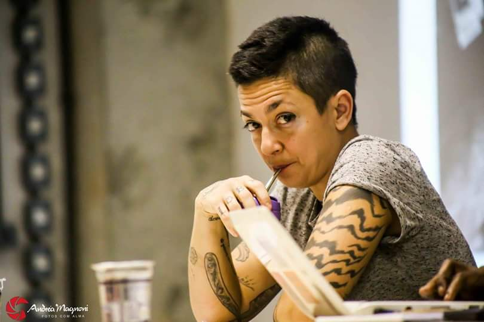
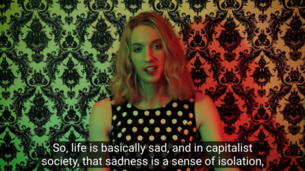
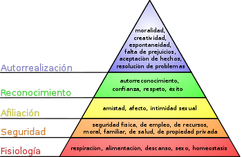

# ¡ACCIONEMOS!

¿Qué podemos hacer? Nuestra posición es una práctica pragmática y eficaz desde el xenofeminismo como filosofía de inspiración de La Partida. Más allá de la coherencia moral, nos interesa agruparnos con formas de vida que nos hagan potentes, es decir, en las formas de vida que procuran el cuidado, el bien común. Por ahora, con nuestra agencia limitada por la poca credibilidad de la juventud, nos toca infiltrarnos e incidir en diferentes medios, en partidos políticos, organizaciones internacionales, medios de comunicación masiva y segmentada, entre otras estructuras.

## Algunas posibles acciones estratégicas

Un Centro de Estudios que brinde a las personas que estudian ahí capacidades de formación en medio de la complejidad y que formen generaciones dispuestas a accionar desde una perspectiva transdisciplinaria y colaborativa, lejos de los dogmas y formalismos de la academia. Como el proyecto de Nick Srnicek con Hellen Hester, autonomy.work. Dentro de los proyectos claves vemos:

Un *think tank* para generar líderes con conciencia crítica, de estrategia y táctica política, además de informes de política económica de desarrollo local y estrategias para hubs y hackatones, además de programas de litigio estratégico rumbo a la creación de un programa de políticas publicas poscapitalista. Necesitamos crear lazos con los entornos tecnológicos progresistas y radicales para poder crear productos accesibles en los mercados que puedan generar bienestar para muchas personas, por ejemplo, a través de franquicias cooperativas.

Ademas, necesitamos crear una plataforma de organización política en línea de arquitectura modular que sea accesible y fácil de implementar. Un excelente punto de partida es el proyecto Decidim desarrollado en el MediaLab en Espana. Nos imaginamos las bases de una interfaz para discusión y gestión democrática de grupos, además de una wiki que funcione como un repositorio copyfair editorializable. Ademas, con tecnologías de georreferenciación.

En términos económicos, hay que crear un ecosistema que facilite la proliferación y producción de redes solidarias. Más allá del movimiento sindicalista, la cooperativa es una unidad económica que realmente garantiza la igualdad democrática desde el trabajo. Quizá la forma más sencilla de hacerlo sería a través de una franquicia cooperativista cuyo soporte sea una wiki con manuales y procesos accesibles en términos de diseño, que crezca bajo una etiqueta (*label*) que represente los valores de esa marca cooperativa.[^26]

Finalmente, es necesario desarrollar un proyecto cultural transmedia que funcione a través de esta lógica y que permita el desarrollo de una cultura popular independiente del mercado *mainstream.* Algo de inspiración para una aventura de esta naturaleza han sido los *Street papers* y proyectos como la Red de Producción y Distribución Vicente Guerrero en México, el manifiesto del Dogma 95 y el formato de producción de bajo costo desarrollado por Robert Rodriguez en su famoso libro *Rebel without a Crew.* En resumen, una cultura de producción *guerrilla cinema.* Las películas *Tangerine* en Estados Unidos y *Oso Polar* en México son una muestra de las posibilidades técnicas de los medios contemporáneos. Sin embargo, el horizonte de un esquema de producción audiovisual militante es ContraPoints, un vlog en YouTube estelarizado por Natalie Wynn.

## Organízate e independízate del Capital

Finalmente, lo más importante es encontrar la forma de compartir recursos que nos permitan crear redes de solidaridad en la producción de insumos clave para cubrir necesidades básicas de grupos y comunidades. En un sentido meramente estratégico, la pirámide de Maslow nos da pistas de las industrias que habría que comenzar a cooperativizar para crear multitudes que se emancipen de los flujos farmacopornográficos, chatarrofágicos y financieros que produce el capitalismo.

Económicamente, problemas como el hambre o la vivienda pueden resolverse con técnicas avanzadas de planificación y coordinación que no podían realizarse en el socialismo de hace casi un siglo por la sencilla razón de que no contaban con las herramientas computacionales necesarias para poder pensar con seriedad en una economía planificada que publique precios y soluciones conflictos de asimetrías de información en el mercado.

Hoy tenemos la capacidad de no solo permitir la proliferación organizada en plataformas comunes de productoras descentralizadas que surtan en función de necesidades y no de plusvalía financiarizable, también podemos implementar sistemas de votación para que estas organizaciones no sean, como lo fueron durante la revolución mexicana, la base de un corporativismo de corte charro. Podemos crear plataformas de economía solidaria capaces de gestionarse autónomamente a través de recursos iterativos de código FLOS. En ese sentido, una etiqueta de franquicia cooperativa sería una buena forma de crear documentación y procesos comunes en un proyecto de riesgo compartido con un contrato claro e incluso inteligente y encriptado.