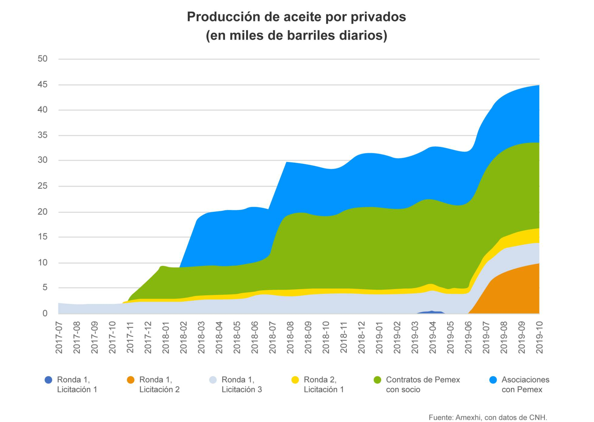

# Resumen interpretativo de la nota (_El desencuentro de López Obrador con las petroleras privadas pone en riesgo el futuro de Pemex_)

**Autor:** Jon Martín Cullell 

## Principales puntos e ideas

1. AMLO y su idea de soberanía energética
2. Impacto negativo en las metas de producción debido a la decisión del gobierno de no licitar más campos.
3. El éxito del gobierno de AMLO y de la 4T se medirá en términos de barriles de petróleo.
4. Las metas de producción proyectadas son difíciles de alcanzar sin la 	ayuda del sector privado ante los enormes niveles de endeudamiento de PEMEX.
5. Cancelación de las rondas petroleras que legó la Reforma Energética de Peña Nieto
6. El presidente justifica estas decisiones debido a la escasez de la inversión y los pobres resultados alcanzados hasta ahora.
7. El sector privado justifica su incapacidad debido a la "complejidad del sector".
8. Las empresas han cumplido en general con lo acordado en los contratos, al menos con lo mínimo establecido en ellos, salvo una excepción.
9. Más allá de la producción, el sector privado destaca su aportación a las arcas del Estado.
10. El caso del campo Zama donde Talos y PEMEX lo tienen compartido y no se pone de acuerdo en su explotación.

## Análisis
Al principio el autor señala que PEMEX es la petrolera más endeudada del mundo, pero no ahonda en las razones de dicho nivel de endeudamiento. En realidad no es tan difícil de entender, sucede que la Reforma Energética estaba diseñada, en parte, para llevar a PEMEX a la quiebra, pero ni así se consiguió y se tuvo que recurrir a ilegalidades y otra serie de prácticas que buscaron acelerar ese proceso, uno de ellos era elevar el nivel de endeudamiento y destinar la inversión a invertir en títulos financieros de otras petroleras en vez de hacerlo en la parte operativa que es lo que en realidad podía mejorar a la empresa y darle valor; que es justo lo que ha decidido hacer este gobierno y es el motivo de rechazo del sector privado y el origen de notas como esta.

Me parece que la gráfica que se muestra en la nota:

Es bastante interesante y en parte contradice lo dicho en el artículo. Si miras bien la parte más significativa es la que forman los contratos de PEMEX con socio [privado] y las asociaciones con PEMEX. Entonces cabe preguntar ¿si es tan necesaria la participación del sector privado, porque sus resultados son tan pobres?

Como destaca el autor en la nota, el sector privado se justifica por la "complejidad del sector", ¿cuál será esa complejidad? Cualquier negocio es complejo cuando lo desconoces y careces de los recursos necesarios para invertir, y eso es lo que hay que entender cuando los privados dicen que el sector es muy complejo.

A López Obrador le podemos achacar muchas cosas y podemos dudar de su conocimiento en infinidad de temas, pero si de algo entiende y bastante mejor de lo que muchos creen, es de energía y de petróleo. El presidente tiene datos del sector de primera mano y sabe lo que en realidad ha pasado con la Reforma Energética, algo que está en un nivel distinto al que el autor de la nota maneja desde luego.

Desconozco a qué se debieron las decisiones de bajar la inversión en exploración petrolera que a su vez obligó a PEMEX a reducir su pronostico de producción a final de año. Lo que sé es que como en todos lados, no hay suficiente dinero para invertir lo que se quisiera, ello obliga a la SENER y a PEMEX a ser muy cuidadosos con sus decisiones y apostar a los pozos y campos con mejores probabilidades de éxito, pese a lo que los expertos a favor de la privatización (como David Shields) o la CNH que parece ser su defensor digan.

Y eso tiene todo que ver con Zama, porque algo que en este artículo y en prácticamente ningún otro de corte similar mencionan, es que en las licitaciones petroleras no vinieron las grandes empresas a reglarnos dinero ni a dar millones por un terreno virgen que hay que explorar. Se les entregó (en realidad se les regaló) muchísima información geológica y geofísica que PEMEX acumuló durante décadas y que se pagó con nuestros impuestos, esa misma información que ninguna empresa del sector del mundo afloja por nada y menos gratis; y no sólo eso, se les entregaron pozos, equipo e instalaciones _in situ_, y todo ello debido a un vacío legal en el diseño de la Reforma Energética que no deja en claro cómo los privados _reconocerían las inversiones_ hechas y recibidas sin contraprestación alguna.

De vuelta a Zama, si Talos pudo identificar las reservas y el potencial del campo, no es porque sea una empresa privada y eficiente (en realidad es una petrolera muy pequeña), sino porque pudo aprovechar toda la información recibida de PEMEX, procesarla y listo. No porque haya hecho grandes inversiones en el yacimiento, sino por todo lo que ya habíaa hecho PEMEX y que la Reforma Energética le regaló a Talos. Un campo de ese tamaño no se descubre en unos meses, toma años de exploración, de levantar datos, de hacer pozos exploratorios y mucho trabajo de campo lograrlo. Cabe recordar que la petrolera con mayor experiencia y mejores resultados de todo el mundo en aguas someras es Petróleos Mexicanos, que además es experta en los campos de este lado del Golfo de México.

Y cuando el presidente dice: 
 > ¡Cómo vamos a convocar a nuevas rondas! No tiene sentido. Esto no es un asunto político, ideológico, es juicio práctico. ¿Para qué quieren contratos si no invierten?
 
 Es porque sabe que aunque la AMEXHI diga que están cumpliendo y que están ingresando dinero a las arcas dele Estado, la proporción de lo que aportan en comparación con lo que PEMEX debe entregar por ley es ínfima. 

De los 111 bloques asignados que menciona el autor solamente 29 producen algo y como ya vimos más arriba es PEMEX quien está sacando adelante hasta la producción de los privados.  Entonces, ¿realmente será cierto que PEMEX no puede solo y que necesita de un sector privado que en realidad ni sabe ni puede? Además, como el sector privado tampoco tiene dinero para hacer inversiones tan grandes, ¿valdrá la pena darle el dinero de las AFORES a los privados para que se paren el cuello e inviertan con dinero que no es suyo y cuyos beneficios no están obligados a devolver a los ahorradores? ¿no sería mejor que ese dinero se invirtiera directamente en PEMEX y que los beneficios pudieran reflejarse en las cuentas de los trabajadores cuyo ahorro se usa para invertir en el desarrollo de nuevos campos?